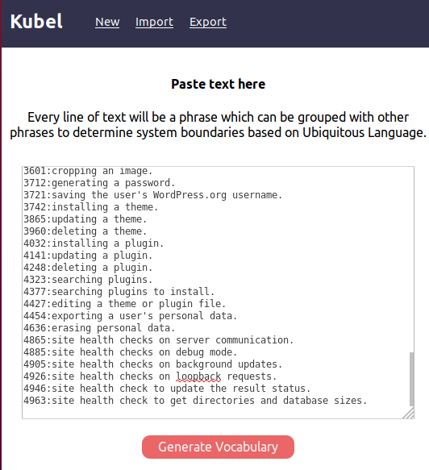
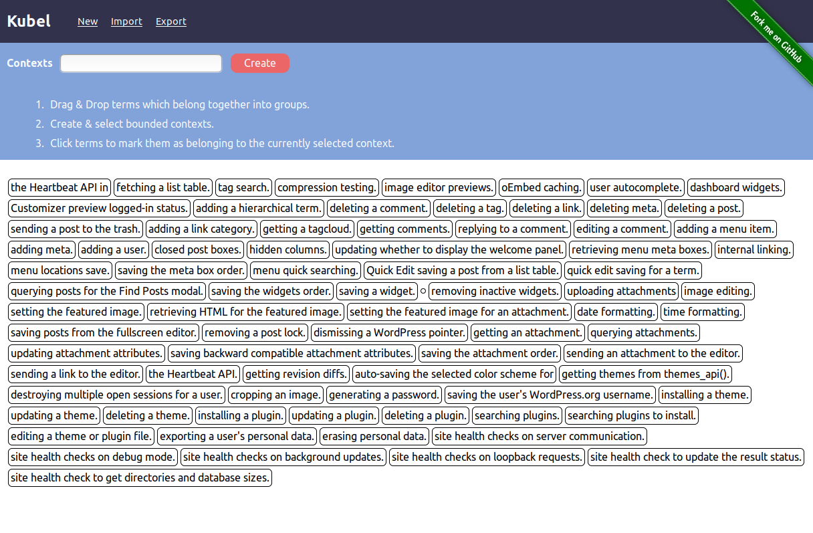
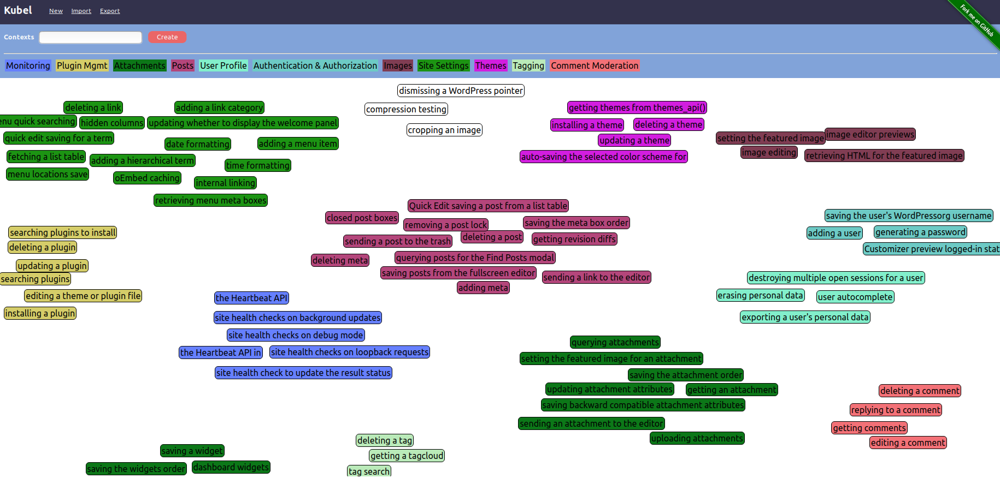

# Kubel

> [Kuebel](https://translate.google.com/#view=home&op=translate&sl=de&tl=en&text=Kuebel) (German): Tub, bucket, pail. 

_Something to keep things in which belong together._

A visual design tool to understand system boundaries

- Where does one microservice end and the next one begin?
- Carving up monoliths: Managing coupling & cohesion.
- Based on Domain Driven Design concepts: Bounded Contexts and Ubiquitous Language.
- Decide on service boundaries, in plain English


## Getting Started

```
git clone git@github.com:robertreppel/kubel.git
cd kubel
yarn start
```

## Legacy Decomposition Example: Wordpress

### Mining the source code

> This isn't to imply that the Wordpress code base isn't great. It just happened to have a nice long piece of source lying about which we can use as an example.

https://github.com/WordPress/WordPress/blob/4c0620bdf8b3c1bac314f6b50f15ee6399710ae5/wp-admin/includes/ajax-actions.php has 5000+ lines.

To get an idea of what areas of responsibility and/or concepts which belong together it may cover, let's do some judicious grep magic to retrieve some comments:

```  

wget -O - -o /dev/null  https://raw.githubusercontent.com/WordPress/WordPress/4c0620bdf8b3c1bac314f6b50f15ee6399710ae5/wp-admin/includes/ajax-actions.php  | grep -E -o -n "Ajax handler for(.*)" | sed 's/Ajax handler for //g
'

```

... results in a list of "Ubiquitous Language" in that file. Parsing out variable- and function names names, etc. and other types of comments as well would be even better, but let's start simple.

### Generate Vocabulary

Take the resulting list of phrases and paste it into https://robertreppel.github.io/kubel (or your own instance at http://localhost:3000):



Hitting "Generate Vocabulary" will turn every line into something that can be dragged and dropped:



### Exploring the Ubiquitous Language and finding Bounded Contexts

Spend some time grouping things that seem to belong together and to create new Bounded Contexts (... a.k.a. "services"):



Without knowing any details of the source code, this gives an overview of what it claims to do. Once Kubel implements tracking line numbers in the source, it should be possible to get an idea about cohesiveness (how many lines between related concepts?) and to have links from the Kubel diagram directly to the source.


## Build Configuration 

### Google Analytics 

Before yarn build, set an environment variable with your own Google Analytics tracking code: export REACT_APP_KUBEL_GOOGLE_ANALYTICS_TRACKINGCODE=UA-XXXXXXXXX-X


